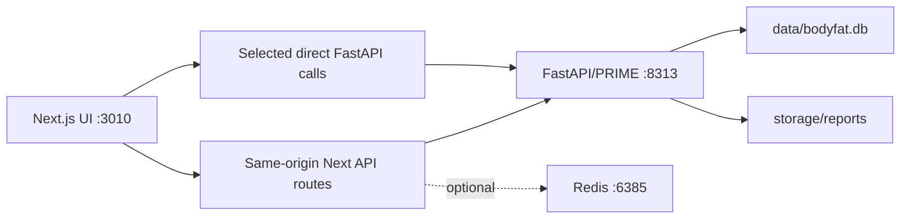

# Apex Fit Developer Guide

**Current as of:** August 11, 2026

## Architecture



### Main directories

| Path | Responsibility |
| --- | --- |
| `src/app/` | Next.js pages and API route handlers |
| `src/components/` | Shared UI, dashboard, cycle, report, challenge, and settings components |
| `src/contexts/` | Application state/reducer/actions and persistence orchestration |
| `src/lib/` | Data sync, cycle/report/challenge contracts, theming, webhook, nutrition, and utilities |
| `src/types/` | Shared TypeScript contracts |
| `python-api/` | FastAPI, PRIME engine adapters, repositories, schema initialization, reports |
| `python-api/alembic/versions/` | Additive schema migrations |
| `tests/` | Vitest/Playwright tests |
| `openspec/` | Accepted specs and active change records |
| `_ops/` | Local lifecycle/supervisor tooling |
| `data/` | Canonical SQLite and protected local backups |
| `storage/reports/` | Generated report artifacts |

## Core domain invariants

1. SQLite is authoritative; Redis is optional.
2. The canonical local user is `default`.
3. At most one active cycle exists for that user.
4. Starting a program preserves profile/history and refreshes an editable baseline.
5. Entry persistence succeeds before UI success/navigation.
6. Entry saving and report generation are separate user actions.
7. Report scope is explicit; stopped cycles are never silently current.
8. Living Report inputs are cycle-scoped and use cycle dates.
9. Activated 14-day plans are immutable snapshots; future changes create amendments/revisions.
10. Missing/ranged PED source data is not inferred, substituted, or optimized.
11. Manual inventory is a coverage constraint, not a recommendation engine.
12. External AI explanation cannot mutate schedules, calculations, inventory, or report history.

## Standard-program transaction boundary

The UI currently performs cycle creation and profile persistence as separate writes. If profile save fails, it attempts to reactivate the previous cycle or stop the new cycle. This reduces ordinary split state but cannot protect against a process crash between requests. The planned durable fix is one backend transaction that updates previous-cycle status, creates the new cycle, and saves the profile/program baseline atomically.

Do not remove the compensation until that transaction endpoint and failure tests exist.

## Data access rules

- Prefer same-origin Next data routes from browser components when a gateway exists.
- Challenge APIs use the `/python-api/:path*` rewrite or the shared challenge client.
- Preserve extra/versioned fields through TypeScript, Next, Pydantic, repository, and SQLite round trips.
- Do not warm-write a normalized Redis copy back over canonical Python data.
- Treat a 404 deletion of an already-absent record as an idempotent terminal state when the endpoint contract says so.
- Report list paths should remain lightweight; detail is fetched lazily.
- Never log complete profiles, PED schedule details, AI keys, webhook URLs, or reusable credentials.

## Date rules

- Persist day dates as `YYYY-MM-DD`.
- Parse cycle dates as date-only values; avoid browser-timezone shifts from implicit UTC/local conversions.
- Compute current week as `floor(days_since_start / 7) + 1`, bounded to the timeline.
- A 14-day challenge is an inclusive exact day contract and maps to two PRIME weeks.
- Date display preference is not yet globally enforced; do not claim otherwise.

## Reporting rules

- Report generation is explicit.
- Report Center owns the standard duplicate/source-fingerprint gate.
- A dashboard CTA routes into Report Center rather than bypassing the gate.
- Living Reports receive the selected cycle's entries only.
- 14-day reports render from the frozen plan/protocol/inventory snapshot plus daily logs/amendments.
- Startup artifact ingestion must recognize artifacts already represented by canonical report rows.

## 14-day and PED safety rules

- Separate nutrition/training template revisions from protocol schedule revisions.
- Require two explicit consecutive source weeks.
- Preserve source hash, literal source values, missing values, and range text.
- Inventory items remain unusable until required label/identity/unit/quantity/expiry fields are confirmed.
- Use Decimal-based allocation; reject incompatible units, expired inventory, shortages, and non-divisible tablet/capsule events.
- Member confirmation, documented review, and clinical validation are distinct states.
- An amendment may affect only future/uncompleted days and records reason plus before/after state.

## UI and theme rules

- All primary navigation is route-based and keyboard accessible.
- Seven palette choices exist independently of Light/Dark/System mode.
- Use semantic palette tokens for new work. Hard-coded prototype colors on modern pages are known debt, not a pattern to copy.
- Preserve the uploaded banner in the current shell.
- Do not label stored-but-unused Settings values as globally active.
- Test pages must be gated or removed before network exposure.

## n8n boundary

`src/lib/weighinWebhook.ts` is a browser-side, best-effort local MVP. It requires an active cycle and saved weigh-in days, posts after standard report success, and supplies `cycle_id:date` as `idempotency_key`. The downstream workflow must enforce that key. A remote/multi-user implementation requires a server-side signed delivery service, encrypted credential storage, retries, and an audit table.

## Development workflow

```powershell
npm install
python -m pip install -r .\python-api\requirements.txt

# API
Set-Location .\python-api
python main.py

# Web from repository root
npm run dev
```

Use `_ops/apex_lifecycle.py` for the normal detached local lifecycle. The local dev port is `3010`; FastAPI is `8313`.

## Required verification

Choose the smallest relevant tests during implementation, then run the release gates for cross-cutting changes:

```powershell
npx tsc --noEmit
npm run build
python -m pytest python-api\tests\unit -q
npx playwright test tests\e2e\modern-workspace.spec.ts --project=chromium --workers=1
openspec validate add-two-week-cut-challenge --strict
openspec validate update-interface-palettes-and-feature-lab --strict
openspec validate add-ai-ped-inventory-scheduler --strict
git diff --check
```

Do not interpret a passing health endpoint as an end-to-end pass. For persistence flows, verify read, write, re-read, cycle ownership, and UI refresh. Do not mutate live member data merely to claim a test pass; use fixtures/copies.

## Documentation and change control

- Read `openspec/AGENTS.md` for proposals, new capabilities, breaking behavior, architecture changes, or ambiguous plans.
- Do not manually edit `.taskmaster/tasks/tasks.json`.
- Update current docs, changelog, verification, and the relevant OpenSpec tasks/spec in the same change.
- Preserve dated audits as evidence and link them to current disposition rather than rewriting their original results.

## Security checklist

- No credentials in source, screenshots, docs, logs, reports, fixtures, or commits.
- Validate uploaded file type/size/path and report artifact filenames.
- Keep CORS and service binding local until authentication exists.
- Minimize health/PED context sent to external AI providers and require deliberate provider configuration.
- Back up SQLite before schema or repair operations.
- Keep member confirmation separate from medical approval.
