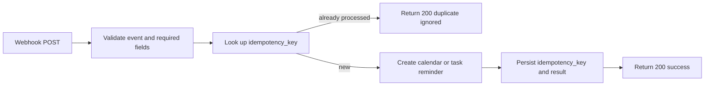

# n8n Weigh-In Reminder Automation

**Current as of:** August 11, 2026

## What Apex Fit does

After a successful **standard report** is generated, Apex Fit can send one best-effort JSON POST to a webhook URL configured in **Settings > Check-ins**. The event describes the next weigh-in for the active cycle. Webhook failure never blocks or rolls back the report.

This is event-driven, not clock-driven. Apex Fit does not independently wake up each morning. Living Reports and 14-day challenge reports do not currently send this webhook.

## Prerequisites in Apex Fit

1. An active cycle must exist.
2. At least one weekday must be selected and saved in **Weigh-In Schedule**.
3. A valid `http://` or `https://` n8n production webhook URL must be saved.
4. The next weigh-in date must be calculable from the current local date and selected weekdays.

If any prerequisite is missing, **Send test** does not emit a placeholder event. It reports the missing requirement.

## Payload

```json
{
  "event": "next_weighin",
  "idempotency_key": "cycle-id:2026-08-14",
  "next_weighin_date": "2026-08-14",
  "cycle_id": "cycle-id",
  "cycle_name": "Member - 16-Week Cut",
  "weighin_days": [1, 5],
  "report_title": "Progress Report",
  "generated_at": "2026-08-11T12:00:00.000Z",
  "source": "apexfit"
}
```

Weekday values use JavaScript day numbers: Sunday `0`, Monday `1`, through Saturday `6`.

## Recommended n8n workflow



### Build it

1. Add an n8n **Webhook** node using `POST`.
2. Use the production webhook URL—not the temporary test URL—for the saved Apex Fit setting.
3. Validate that `event` equals `next_weighin` and that `idempotency_key`, `next_weighin_date`, and `cycle_id` are non-empty.
4. Check a durable store for the exact `idempotency_key`. Suitable stores include an n8n Data Table, database table with a unique key, or another transactional store.
5. If the key already exists, return HTTP 200 without creating another event/task.
6. If it is new, create the calendar event, Todoist task, Sunsama task, or other reminder using `next_weighin_date`.
7. Save the idempotency key only with the downstream result. Prefer a unique constraint or atomic create so simultaneous retries cannot both win.
8. Return an explicit 2xx response to Apex Fit.
9. Activate the workflow.
10. In Apex Fit, use **Send test** once and verify both the n8n execution and downstream object.

## Suggested reminder mapping

| Destination field | Apex Fit value |
| --- | --- |
| Title | `Apex Fit weigh-in - {{$json.cycle_name}}` |
| Date | `{{$json.next_weighin_date}}` |
| Description | Report title plus cycle ID; omit sensitive body-composition or PED details unless deliberately required |
| External key | `{{$json.idempotency_key}}` |

## What the idempotency key does not do

The key is only data in the payload. It prevents duplicates only if the n8n workflow stores/checks it. Apex Fit may send the same cycle/date key again after another report or retry.

## Security boundary

- The webhook URL is currently stored in browser localStorage and the browser sends plain JSON directly to it.
- Apex Fit does not add a signature or secret header.
- Use a hard-to-guess HTTPS production URL and limit what the workflow accepts and emits.
- Do not place reusable secrets, provider credentials, complete health records, or PED schedules in the webhook response/logs.
- Before remote or multi-user deployment, move delivery server-side, encrypt the URL/credential, sign requests, add allowlisting, store attempts, and implement retry/audit history.

## Troubleshooting

| Symptom | Meaning/action |
| --- | --- |
| “Start an active ReComp cycle first” | Start/select a current cycle before testing. |
| “Choose at least one weigh-in day first” | Save at least one weekday in the schedule card. |
| “No upcoming weigh-in could be calculated” | Re-save the schedule and confirm the active cycle dates. |
| HTTP 404 | Production/test webhook URL mismatch or inactive n8n workflow. |
| HTTP 401/403 | Authentication/proxy policy blocks the browser POST. Current Apex Fit cannot add a custom auth header. |
| CORS/browser failure | Allow the Apex Fit origin or route delivery through a future server-side relay. |
| Duplicate tasks | The n8n workflow is not atomically enforcing `idempotency_key`. |
| Report succeeded but reminder failed | Expected non-blocking behavior; inspect the n8n execution and URL in Settings. |
