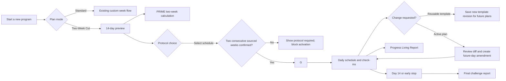

## Context

The current system already has most of the required building blocks:

- `cycles` scopes entries and reports and enforces one active cycle.
- `UserData.timeline_weeks`, `goal_type`, `calorie_floor`, and `ped_stack` reach the PRIME engine.
- PRIME emits weekly calorie, protein, phase, feasibility, cardio, and protocol-derived fields.
- the Living Report can render weekly nutrition, PED timeline, check-off, and safety sections.
- `docs/protocol-data/nutrition-and-ped.json` is the current cached protocol source.

The missing concept is a first-class short challenge with exact day semantics, an editable but versioned nutrition/training template, optional separately reviewed PED content, and snapshots that remain reproducible after source files or active plans change.

## Selected Visual Direction: Quiet Strength

Reference: [`assets/quiet-strength-reference.png`](assets/quiet-strength-reference.png)

### Purpose and audience

The interface is a repeated-use body-composition and plan-management tool, not a marketing page. It serves members who need the next action, current target, progress, and report state to be scannable in seconds while still feeling premium and emotionally grounded.

### Tone and memorable detail

- Tone: editorial, tactile, calm, refined, disciplined, and performance-aware.
- Memorable detail: one cinematic still-life training image anchors the dashboard hero, paired with an editorial serif headline and live plan state.
- The imagery must carry real subject matter—training tools, texture, light, and material—not generic decorative blobs or abstract gradients.

### Visual tokens

| Token role | Direction |
|---|---|
| Canvas | warm near-black, approximately `#121210` |
| Sidebar | `#151513`, separated by one hairline rule |
| Surface | `#1C1C1A`; elevated surface near `#23231F` |
| Border/rule | low-contrast warm graphite near `#3A3933` |
| Primary text | warm bone near `#F1EBE2` |
| Muted text | warm grey near `#AAA49A` |
| Primary action | restrained terracotta near `#C96D4D` |
| Positive/progress | desaturated olive near `#92945F` |
| Secondary data | muted sand near `#D7B476` |
| Warning | amber used only for actionable protocol/safety states |
| Radius | 4–8 px; no inflated soft-card treatment |

The implementation will define semantic CSS variables for these roles and preserve accessible light/dark behavior where required. Status meaning cannot rely on color alone.

### Typography

- Display/metric serif: a high-contrast editorial face, preferably `Cormorant Garamond` loaded through `next/font`, for the hero, major values, and selected report headings.
- Interface sans: `Geist Sans` or the existing sans stack for navigation, controls, table labels, explanatory copy, and dense data.
- Monospace remains reserved for source/version identifiers and highly technical report metadata.
- Serif type is a hierarchy tool, not a universal body font; long instructions and form fields remain sans-serif.

### Layout contract

- Desktop: persistent left navigation; hero occupies roughly two-thirds of the upper content row, with the current nutrition/target panel occupying the remaining third.
- The hero contains one primary action and one secondary quick action. It SHALL NOT become a passive marketing banner.
- Progress charts, weekly rhythm, report state, AI Coach note, active program, and at-a-glance metrics remain visible in the first dashboard scroll region.
- The 14-day challenge uses the same shell and replaces the standard dashboard grid with a day timeline, today's requirements, diet schedule, protocol readiness, and report readiness.
- Cards use hairline boundaries, flat warm surfaces, and minimal shadow. Avoid cards nested inside cards.

### Responsive behavior

- At narrower desktop/tablet widths, the hero and nutrition panel stack before data becomes illegibly compressed.
- The hero crop remains meaningful at every breakpoint and reduces in height on tablet/mobile so it does not displace the current action.
- The sidebar collapses to the existing compact navigation behavior; route labels remain available through an accessible drawer or expanded state.
- Metric grids reduce columns deterministically; labels wrap without changing control height on hover or focus.
- Charts retain visible axes/labels and do not depend on hover-only values.

### Motion and accessibility

- Use restrained 150–200 ms transitions for route context, plan switching, disclosure, and completion state.
- No parallax, continuous ambient motion, glass blur, or decorative animation.
- Respect `prefers-reduced-motion`.
- Text, controls, charts, focus rings, and status indicators must meet WCAG contrast and keyboard requirements.

## Feature Synthesis from the Seven Comps

The comps were alternative visual/hierarchy explorations, not mutually exclusive feature packages. Quiet Strength defines the design system. Widget and workflow ideas from every comp are routed according to data readiness and task context so the dashboard does not become an undifferentiated wall of cards.

### Already backed by current application data

| Capability | Primary surface in Quiet Strength |
|---|---|
| Current weight and body-fat values | Home hero/metric row |
| Weight and body-fat trends | Home summary plus full Progress view |
| Calculated calorie/protein targets | Home nutrition panel and Plan Studio |
| Lean/fat body-composition outputs | Progress details |
| Active cycle, week, goal, and program switching | Persistent plan selector and Home active-plan module |
| Measurement history | Entries and expandable latest-measurements module |
| Report list, preview, and cycle-scoped generation | Home report status and Reports |
| AI Coach insights/chat | Home coach note and AI Coach destination |
| User profile, goals, calorie floor, eating pattern, and supplied PED stack | Plan Studio/Settings |

### Derived from current data or included in the two-week change

| Capability | Derivation and destination |
|---|---|
| Current-plan progress and weeks remaining | Cycle dates/timeline; Home |
| Weekly rhythm and next weigh-in | Cycle weigh-in schedule; Home |
| Goal projection and “why this plan fits” | PRIME outputs/feasibility; Plan Studio |
| Body-composition visualization | PRIME lean/fat mass; Progress |
| Next report and report readiness | Cycle entries/report fingerprint; Home/Reports |
| 14-day timeline and daily plan status | New two-week cycle/day model; Challenge Command Center |
| Diet schedule and protocol readiness | PRIME day adapter plus reviewed snapshot; Challenge Command Center |
| Daily challenge actuals and completion | New lightweight day-scoped challenge log; Challenge Command Center and report |
| Progress/final challenge report | Existing Living Report extended by this change; Reports |

### Valuable concepts that require new persistent product features

| Concept shown in comps | Missing capability |
|---|---|
| Meal-level consumed calories and live macro rings | Granular food/macro logging schema and meal entry UX; challenge scope stores only daily totals |
| Meal agenda and “log next meal” | Meal records, schedule, and quick-add flow |
| Wearable-synchronized steps | Device integration; challenge scope permits a manually entered daily total |
| Exercise-level workout history and training agenda | Workout/task records; challenge scope stores daily training/cardio completion and notes |
| HRV and calculated recovery score | Device integration and a defined scoring contract; challenge scope stores raw sleep and optional resting heart rate |
| Daily adherence score | Defined inputs, weighting, persistence, and explanation |
| Check-in streaks and achievements | Event ledger, streak rules, badge definitions, and backfill behavior |
| Rearrangeable/customizable dashboard | Per-user widget layout/preferences and responsive constraints |
| Global search and notifications | Search index/commands and notification/event model |

These concepts SHALL NOT display fabricated live values. They require a separately approved implementation scope or an explicit “not connected”/empty state.

### Surface model

1. **Home / Today:** cinematic Quiet Strength hero, one primary action, core metrics, nutrition target, today/weekly rhythm, active plan, report status, AI Coach note, and optional user-enabled summary widgets.
2. **Plan Studio:** current metrics, goals, duration, calorie floor, projected progress, rationale, weekly schedule, editable challenge templates with revision history, protocol inventory/status, and report preview.
3. **Progress:** detailed weight/body-fat/body-composition charts, measurements, adherence when supported, and later achievements/streaks.
4. **Reports:** cycle selector, readiness, progress/final Living Reports, comparison, preview, and download.
5. **14-Day Command Center:** day 1–14 timeline, today's requirements, diet schedule, reviewed protocol snapshot, safety/readiness, explicit future-day amendment flow, and report completion.
6. **Quick Add:** current measurement entry first; meal, workout, recovery, and note actions appear only as their backing features are implemented.

This structure preserves all valuable ideas without forcing every card into the initial dashboard viewport.

## Goals / Non-Goals

### Goals

- Make the two-week cut a separate selectable challenge while preserving standard programs.
- Keep calculations in the existing PRIME engine and retain its calorie-floor, protein-floor, feasibility, and ceiling behavior.
- Turn two weekly prescriptions into a legible 14-day schedule using configured training/rest/PSMF day types.
- Let the user edit the reusable template, retain every revision, and explicitly amend future days of an active challenge.
- Keep reports reproducible by storing the template revision, plan snapshot, amendment history, and optional protocol snapshot used for each day.
- Require an explicitly selected, source-backed two-week PED schedule for activation and complete report generation.
- Preserve every existing route and workflow through the UI redesign.

### Non-Goals

- The application will not choose the "best" PED, prescribe a compound, create a dose, or fill gaps in source protocol data; it selects from and tracks member-supplied sourced schedules.
- The application will not treat a user acknowledgement as medical approval.
- The application will not silently lower calorie/protein floors or move a goal deadline to force a favorable projection.
- The first implementation will not add social leaderboards, payments, or public challenge sharing.

## Decisions

### Decision: Extend cycles instead of creating a parallel challenge store

Add nullable/defaulted cycle fields:

| Field | Purpose |
|---|---|
| `plan_mode` | `standard` (default) or `two_week_cut` |
| `timeline_days` | Exact duration; `14` for the challenge |
| `template_id` | Stable reusable challenge-template identity, nullable |
| `template_revision_id` | Exact template revision selected at activation, nullable |
| `plan_snapshot_json` | Complete immutable calculated/instruction snapshot created at activation |
| `current_plan_revision` | Monotonic active-plan revision number; starts at 1 |
| `protocol_id` | Stable protocol identifier, nullable |
| `protocol_version` | Human-readable/source version, nullable |
| `protocol_status` | `not_provided`, `draft`, `reviewed`, or `superseded` |
| `protocol_start_week` | Explicit source week used for challenge day 1 |
| `protocol_snapshot_json` | Immutable source-derived snapshot used by this cycle |
| `safety_acknowledged_at` | UI acknowledgement timestamp; not medical approval |

This preserves the one-active-cycle invariant, entry/report scoping, archives, and history. Existing rows migrate to `plan_mode='standard'` and leave the other fields null.

Alternative considered: a new `challenges` table. Rejected for the first version because it would duplicate cycle lifecycle, entry ownership, report scoping, and active-state reconciliation.

### Decision: Separate reusable template editing from active-plan amendments

The preliminary source is preserved at [`assets/two-week-cut-preliminary.md`](assets/two-week-cut-preliminary.md), mapped by [`assets/two-week-cut-template-mapping.md`](assets/two-week-cut-template-mapping.md), and enters the product as a `draft` template. SQLite adds three normalized stores:

| Store | Required content |
|---|---|
| `challenge_templates` | stable identity, display name, duration, lifecycle status, current revision pointer, created/updated timestamps |
| `challenge_template_revisions` | immutable revision number, raw/source Markdown or source reference, structured JSON, source hash/provenance, validation status, revision note, created timestamp |
| `challenge_amendments` | cycle, effective day/date, reason, before/after patch, prior/resulting plan revision, acknowledgement/review evidence, created timestamp |
| `challenge_daily_logs` | cycle/day/date, effective plan revision, calorie/protein totals, steps, training/cardio completion, sleep, resting heart rate, optional blood pressure/notes, checkpoint waist/photo references, created/updated timestamps |

Saving in Template Editor always creates a revision; it never updates revision content in place. Restoring an older version copies it into another new revision so the full chain remains intact.

Activation stores `template_revision_id` and a complete `plan_snapshot_json`. A later reusable-template edit affects future previews only. To change an active plan, the member must open **Amend active plan**, review a before/after diff, choose the first affected uncompleted day, state a reason, and confirm. The system creates a new plan revision and applies it only from that day forward. Completed days, recorded actuals, and historical reports remain governed by the revision that was effective at the time.

Alternative considered: mutate one JSON template and one active snapshot in place. Rejected because it would make past reports irreproducible and conceal which instructions governed completed days.

### Decision: Use exact day semantics at the boundary and weekly PRIME math internally

The frontend sends `plan_mode='two_week_cut'` and `timeline_days=14`. The server derives an inclusive 14-day range and calls PRIME with `timeline_weeks=2`. The gateway MUST NOT recompute the challenge as 1 or 3 weeks because of date rounding or timezone differences.

PRIME remains authoritative for calories, protein, expected progression, feasibility, cardio ceilings, and floors. A small day-schedule adapter maps each of the two weekly outputs to seven configured day types. It does not recalculate metabolic targets.

### Decision: Version nutrition/training templates separately from required PED schedule data

The captured preliminary source supplies the nutrition, training, cardio/movement, recovery, measurement, adjustment, safety, appearance-day, rationale, checklist, and reference modules listed in the mapping asset. It does not supply a PED schedule. Its structured template MUST retain explicit assumptions and conditional branches rather than flattening example values into member facts.

The PED runtime object is separate and contains:

- `protocol_id`, `version`, `status`, `reviewed_at`, review evidence, and source provenance
- optional day-indexed protocol instructions copied verbatim from the source
- explicit `not_specified` values for every absent item
- source safety notes and stop/escalation conditions

The first supported source is the existing `docs/protocol-data/nutrition-and-ped.json` protocol, whose metadata records document provenance and literal extraction. Its `weekly_timeline` contains source weeks 2–16; source week 1 is explicitly absent. The member selects the exact starting source week, and the adapter must find that week plus the next consecutive week. Missing, ranged, or unspecified source values remain visibly ranged or unspecified.

Activation requires a selected schedule revision, source-week pair, and explicit member confirmation that the schedule is the one being tracked. The application records clinical-review status separately and never labels user confirmation as medical approval. Activation copies the exact two-week schedule into `protocol_snapshot_json`; later protocol edits create a new version and do not silently rewrite a cycle.

The current profile may contain `ped_use=true` or a partially filled `ped_stack`. Those signals do not satisfy schedule readiness. The activation screen derives the stack from the selected schedule, shows it for confirmation, then passes that exact source-derived stack to PRIME.

### Decision: One calculation snapshot drives plan and report

The calculation path is deterministic:

1. Load the active member metrics and goal.
2. Load the selected nutrition/training template revision.
3. Load and validate exactly two consecutive PED source weeks.
4. Derive a source-bound stack for each week and pass it into PRIME's existing compound modifier path.
5. Produce exact 14-day calories, protein, feasibility, composition projection, cardio, training, and PED timing.
6. Save the inputs, modifier outputs, plan days, and provenance as one immutable plan revision.
7. Generate progress/final Living Reports from that same revision plus recorded actuals.

Editing nutrition or PED inputs for future days creates an amendment, re-runs PRIME for the affected future window, and creates a new calculation/plan revision. Reports never recalculate against whichever template or protocol happens to be latest.

### Decision: Separate preview, activation, and completion states

- Preview may show provisional nutrition targets before a PED schedule is selected, but it is visibly incomplete.
- Activation and complete plan/report generation require a source-backed two-week PED snapshot and member confirmation.
- A progress report may be generated only after activation; a final report uses the schedule and calculation revisions effective across all completed days.
- Report generation is available throughout the challenge as a progress report; the final label appears only after day 14 or an explicit early stop.

### Decision: Treat UI modernization as a shared shell migration

The chosen visual direction will be implemented through shared tokens and primitives (layout, card, navigation, typography, status, chart, and form patterns). Existing pages remain reachable from the persistent navigation. The challenge adds a program selector entry and dedicated route/view; it does not replace Dashboard, New Entry, Entries, Reports, Progress, Calculator, AI Coach, or Settings.

## Proposed Flow

## Safety and Data Rules

- Protocol presentation is source-bound: render stored text/values or `Not specified`.
- Do not emit generative “best compound,” dose optimization, substitution, escalation, or interaction advice.
- A missing protocol never falls back to the existing 15-week PED timeline.
- A 14-day schedule can reuse the existing sourced protocol only through explicit revision and starting-week selection; it never guesses the applicable phase from `ped_use` alone.
- Template import and safety-state validation are deterministic pure transformations without database or UI side effects; persistence occurs only after validation succeeds.
- Missing data required by an instruction or safety rule fails closed as unavailable or blocked, not implicitly safe.
- A critical safety-text or reviewed-protocol amendment is a persistent blocking review state, never a dismissible toast; acknowledgement/review evidence is retained in the audit trail.
- The application MUST NOT claim medication interaction or dose validation unless a separately approved, maintained validation dataset and complete required inputs exist. It labels the schedule as tracked source content, not a prescription or safety determination.
- Calorie/protein feasibility warnings stay visible in previews, active views, and reports.
- Sensitive body/health payloads must not be written to ordinary application logs.
- Daily values and photo references are sensitive member data and use the existing authenticated/local data boundary; reports include them only in the owning cycle.
- Protocol source provenance and version appear in the report.

## Risks / Trade-offs

- A 14-day goal may exceed current feasibility ceilings. Mitigation: show PRIME's capped result and residual gap; never promise the requested target.
- The existing gateway derives weeks from dates. Mitigation: add explicit day-mode validation and contract tests for exactly 14 days.
- Existing protocol data starts at weekly granularity and may not describe a two-week cut. Mitigation: never reuse or interpolate it; wait for the dedicated source.
- Free-form editing can create contradictory days or unsafe omissions. Mitigation: validate the complete revision, show blocking field-level errors, preserve safety requirements, and never label unvalidated content reviewed.
- Active edits can falsify history. Mitigation: immutable template revisions, future-effective amendments, completed-day protection, and revision-aware reports.
- The source asks for actuals that the current app does not persist. Mitigation: add the narrowly scoped daily-log record required for challenge adherence/reporting while deferring granular meals, wearables, HRV scoring, and exercise-by-exercise history.
- Schema growth can create drift between TypeScript, Pydantic, and SQLite. Mitigation: one contract fixture plus migration, API, and round-trip tests.
- A large visual rewrite can break hidden functionality. Mitigation: shared shell first, route parity inventory, and end-to-end tests for every navigation destination and critical workflow.

## Migration Plan

1. Back up the SQLite database and verify it opens before migration.
2. Add nullable/defaulted fields to `cycles` plus template-revision, amendment, and daily-log tables; migrate existing rows to `standard`.
3. Import the captured source as a draft revision and round-trip old/new rows, revisions, amendments, and daily logs through FastAPI before changing UI consumers.
4. Add request types and the two-week preview adapter behind `plan_mode`.
5. Add the chosen shared visual system and migrate the shell without changing routes.
6. Add Template Editor and revision history, then two-week selection/preview, activation/daily view, active amendments, and reporting.
7. Run unit, contract, migration, historical-reproduction, report parity, accessibility, and Playwright workflows.
8. Roll back by disabling the selector/editor while leaving additive tables and fields intact; existing cycles continue unchanged and imported revision data remains recoverable.

## Open Questions

- Final user-facing name: “Two-Week Cut”, “14-Day Cut”, or “Two-Week Emergency Cut”.
- Quiet Strength is selected as the shared UI direction; final hero artwork and exact licensed/open font files remain implementation assets.
- Canonical runtime location for the approved structured template; the preliminary source and schema mapping are now captured in this change.
- Who/what sets `protocol_status='reviewed'`, and what review evidence must be recorded.
- Which existing sourced protocol revision and starting source week apply to each activated challenge; this is an activation-time member choice, not a global assumption.
- Whether the user accepts completed-day immutability and future-effective amendments as the editing model (recommended: yes).
- Whether an early-stop report is labeled “Final” or “Stopped early”.
